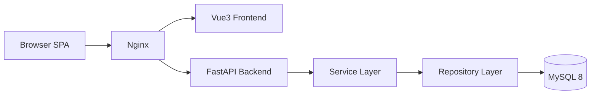
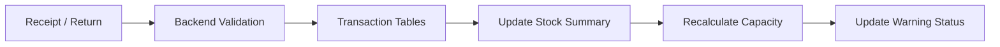
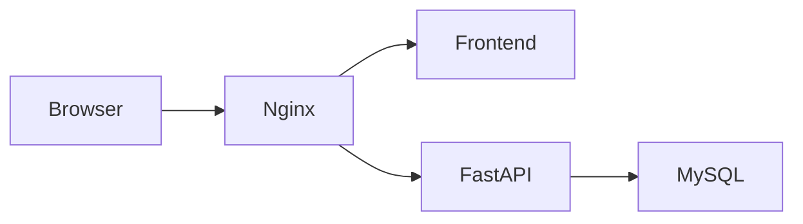

# ARCHITECTURE.md

# Fixture-M Lite Architecture

## 1. System Overview

Fixture-M Lite is a lightweight fixture inventory and production capacity management platform.

The system is designed for:

- Production fixture inventory control
- Production station planning
- Fixture location lookup
- Fixture demand management
- Stock warning management
- Optional file-based fixture image preview
- Fast search workflow
- Touch-friendly and keyboard-usable operational UI across shell, search, inventory overview, and master-data workspaces

The Lite version intentionally avoids heavy lifecycle management logic.

---

## 2. System Goals

Primary goals:

- Easy to maintain
- Fast to develop
- Simple business logic
- Clear UI workflow
- Search-first experience
- Backend-driven architecture
- Production floor usability

---

## 3. High-level Architecture



---

## 4. Technology Stack

### Frontend

| Component | Technology |
|---|---|
| Framework | Vue 3 |
| Build Tool | Vite |
| Language | TypeScript |
| State Management | Lightweight reactive app state + composables |
| UI Style | Industrial Card UI |

### Backend

| Component | Technology |
|---|---|
| API Framework | FastAPI |
| Validation | Pydantic |
| ORM | SQLAlchemy |
| Auth | JWT |
| App / Audit Logging | Python `logging` + rotating file handler |

### Database

| Component | Technology |
|---|---|
| Database | MySQL 8 |
| Migration | Alembic |

---

## 5. Frontend Architecture

```text
frontend/
├─ src/
│  ├─ components/
│  ├─ composables/
│  ├─ pages/
│  ├─ router/
│  ├─ utils/
│  ├─ api.ts
│  ├─ appState.ts
│  └─ styles.css
```

### Main frontend pages

```text
pages/
├─ InventoryPage.vue
├─ SearchWorkspacePage.vue
├─ MasterPage.vue
└─ ProductionPage.vue
```

Current shared-component direction:

```text
components/
├─ UiAutocompleteInput.vue
├─ app/
│  ├─ AppTopbar.vue
│  ├─ AppMobileDrawer.vue
│  ├─ AppGlobalModals.vue
│  └─ AppReleaseNoticeModal.vue
├─ inventory/
│  ├─ BatchImportPanel.vue
│  ├─ InventoryExportPanel.vue
│  ├─ InventoryOperationBoard.vue
│  └─ InventoryOverviewPanel.vue
├─ master/
│  ├─ FixtureQualityPanel.vue
│  ├─ MasterListPanel.vue
│  ├─ MasterDetailPanel.vue
│  ├─ TransactionAccountListPanel.vue
│  └─ TransactionAccountDetailPanel.vue
├─ production/
│  ├─ ProductionHeaderSection.vue
│  ├─ ProductionCapacityPanel.vue
│  ├─ ProductionDetailSection.vue
│  └─ ProductionBatchImportModal.vue
├─ search/
│  ├─ FixtureInfoPanel.vue
│  ├─ ModelInfoPanel.vue
│  ├─ FixtureEditForm.vue
│  ├─ ModelEditForm.vue
│  ├─ SearchHeroSection.vue
│  └─ SearchResultPanel.vue
└─ common/
   ├─ GuidedTour.vue
   ├─ InlineSpinner.vue
   └─ OnboardingFlowPicker.vue
```

Composable / helper notes:

- `frontend/src/composables/useProductionBatchImport.ts` now owns Production batch modal state, batch row lifecycle, and submit orchestration
- `frontend/src/composables/useProductionEditorState.ts` now owns Production editor state, autocomplete handlers, selection sync, and unsaved-change guards
- `frontend/src/utils/productionBatchImport.ts` holds pure parsing, similarity matching, row-state reduction, and CSV assembly rules for Production batch import
- `frontend/src/components/UiAutocompleteInput.vue` is the shared autocomplete input shell used by Production editing flows
- `frontend/src/pages/ProductionPage.vue` is kept as route-level orchestration plus data loading, rather than carrying batch domain logic inline
- `frontend/src/pages/MasterPage.vue` now acts as route-level orchestration for both classic master-data CRUD tabs and the admin-only transaction-ledger management tab

Application shell notes:

- Login / guest entry is rendered in the root app shell before route content
- `/inventory` remains the operation-focused receipt/return page
- `/inventory/overview` remains a full-page route, and its primary entry is the top-bar `更多功能` menu
- `MasterPage` tabs now map to explicit routes: `/master/fixtures`, `/master/models`, `/master/stations`, `/master/customers`, `/master/users`, `/master/ledger`, `/master/quality`
- master-data list panels now surface `current page / total pages / total rows` and paging actions above the list table, instead of below it
- guest users do not see `資料維護`, and router guard blocks direct `/master` access
- the current shell is a top bar rather than a left sidebar
- the top bar surfaces login state, customer switch, today receipt/return totals, and low-stock count
- the top bar provides primary `收/退料`, `收退料資訊匯出`, and `新手教學` actions
- the top bar provides a `更多功能` menu with `收退料總檢視` / `資料維護` / `產能管理`
- clicking the logo returns to `/search`
- `MasterPage` and `ProductionPage` each provide a local `返回搜尋` action
- the desktop top bar now drops into a compact-header mode below `1200px`, rather than holding a crowded two-row desktop layout until phone width
- top-bar daily metrics now use click/tap popovers with keyboard close behavior, rather than hover-only disclosure
- mobile layout keeps a persistent hamburger trigger plus current customer name, with non-essential controls collapsed into the menu
- the mobile drawer is now a scrollable panel with a sticky header, and primary actions are placed ahead of summary stats
- mobile drawer also exposes `新手教學`, so onboarding replay is not tied to the search page alone
- the root shell now owns the onboarding picker and reuses `data-tour` anchors rendered across multiple pages
- onboarding state is stored in lightweight reactive app state and uses route-aware step syncing
- onboarding is now grouped into selectable flows so users can choose a page- or tab-specific tutorial instead of replaying one long linear tour
- the onboarding picker is currently consolidated into five flows: `查詢工作台`, `批次收 / 退料 & 收退料總檢視`, `治具 / 機種 / 站點主資料`, `機種站點對應 & 站點治具需求`, and `收退料帳目管理 / 治具資料品質`
- the root shell also owns a versioned release-notice modal, with copy defined in `frontend/src/releaseNotice.ts`
- release-note dismissal is now one-time per version per browser via `localStorage`, rather than once per account

---

## 6. Backend Architecture

```text
backend/
├─ app/
│  ├─ routers/
│  ├─ services/
│  ├─ repositories/
│  ├─ schemas/
│  ├─ models/
│  ├─ core/
│  └─ utils/
```

### Backend responsibilities

| Layer | Responsibility |
|---|---|
| Router | API endpoint and request handling |
| Service | Business logic and calculation |
| Repository | Database query and persistence |
| Schema | Request/response validation |
| Model | Database table mapping |
| Middleware | Cross-cutting request audit logging |

---

## 7. Core Modules

### 7.1 Master Data Module

Includes:

- Customers
- Fixtures
- Models
- Stations
- Customer-to-user assignment
- Fixture responsible-user assignment
- Reversible active/inactive state management for fixtures, models, stations, and users
- Admin-only transaction ledger workspace for inventory case review, reversal, and customer-scoped stock-state recovery
- Admin-only fixture data-quality workspace for integrity review of master data, image coverage, model linkage, and stock consistency
- Issue-specific navigation rules from the quality workspace into fixture maintenance or search results
- Admin-only permanent fixture deletion with an explicit preserve/delete transaction-history choice
- Admin-only permanent model deletion with an explicit warning that related model-station mappings, fixture requirements, and affected capacity summaries will be removed together
- Admin-only permanent station deletion with an explicit warning that related model-station mappings, fixture requirements, and affected capacity summaries will be removed together
- Master-data desktop layout now keeps list/detail split view down to about `1100px`; phone-width flow switches to `list -> detail` instead of long stacked scrolling
- Master-data list rows are keyboard-operable and focusable, not mouse-only table rows

API prefix:

```text
/api/v2/master/*
```

---

### 7.2 Inventory Module

Includes:

- Receipt
- Return
- Inventory query
- Transaction history
- Export
- Report export (`xlsx` / `txt`) and preview
- Stock summary
- Batch paste import for receipt/return
- Return-mode parse-time inventory precheck against identifier stock summary
- On-the-fly fixture creation from pasted rows
- Similar-fixture confirmation before import
- Unified single identifier flow for all fixture transactions
- Free-form transaction number for each batch import
- UI-visible inline row errors and toast feedback for failed inventory submissions
- Preview-time `current stock` and `post-transaction stock` columns for each identifier row
- In-batch sequential stock preview for repeated `fixture + identifier` rows
- Two-minute duplicate-submission guard for same user + same transaction signature
- Shared batch-import UI used by both `/inventory` and the global shell modal
- Admin transaction reversal with full customer-scoped stock recomputation
- Admin one-click inventory-state rebuild from persisted transaction items
- Inventory overview filters now use a primary + advanced split with responsive `4 / 3 / 2 / 1` column behavior, instead of collapsing to a single long column too early

API prefix:

```text
/api/v2/inventory/*
```

#### Inventory UI behavior

The inventory page now supports one operational entry path and one overview path:

- Batch paste import from clipboard rows
- Transaction overview with in-page filtering only; history export is handled through the shared export flow rather than an overview-page CSV action

Current layout direction for inventory entry points:

- `/inventory` keeps the full operation workspace route
- the global top-bar `收/退料` button opens a modal that exposes only the shared batch-import flow
- the global top-bar `收退料資訊匯出` button opens a modal that exposes report preview and export options
- the global modal intentionally excludes stock overview, low-stock panel, and recent-transaction panels
- after a successful modal submission, the input is cleared but the modal stays open for consecutive batches
- tutorial mode can run the batch-import UI without writing official inventory transactions, for onboarding use only
- the batch-import textarea captures `Tab` and inserts a literal tab character so users can type spreadsheet-style rows manually when clipboard paste is unavailable
- onboarding selectors that target inventory controls inside the global modal must be scoped under the modal container, because some `data-tour` names are reused in the full `/inventory` page layout

Batch paste import accepts rows in either of these practical formats:

- Two-line pairs:
  - `fixture-code-identifier`
  - `quantity`
- Delimited single lines from spreadsheets:
  - `fixture-code<TAB>identifier<TAB>quantity`
  - `fixture-code|identifier|quantity`

All imported rows are normalized into:

- `fixture_id`
- `ownership_type`
- `identifier`
- `quantity`

Identifier rule:

- only pure-numeric `identifier` values with length `1-4` trigger strict normalization and are left-padded to 4 digits before write
- numeric values longer than 4 digits are treated as legacy values and stored as-is
- non-pure-numeric values are treated as legacy values and stored as-is
- transaction query / export filters reuse the same rule through a shared backend utility, so write-time normalization and query-time matching stay aligned

The frontend no longer asks users to pick or maintain:

- `manage_type`
- separate legacy identifier categories

Display wording rule:

- UI copy may present `identifier` as `datecode/編號`
- API, schema, and database contracts still stay on `identifier`
- frontend write-side normalization is centralized in `frontend/src/utils/identifier.ts`, so batch-import parsing does not duplicate the short-numeric padding rule

When the pasted fixture code does not exist:

- The UI prompts to create the new fixture
- If the user declines, the row is skipped

When the pasted fixture code is close to an existing fixture code:

- The UI asks the user to confirm whether it is the same fixture
- If confirmed, the row is replaced with the existing fixture
- If denied, the UI falls back to the add-or-skip decision

Batch import still uses the existing inventory transaction APIs:

- `POST /api/v2/inventory/receipts`
- `POST /api/v2/inventory/returns`

Duplicate-submission behavior:

- the backend compares recent submissions within a 2-minute window
- the duplicate signature is: same user, same transaction type, same transaction number, and the same set of `fixture + identifier + quantity + ownership_type` items
- when a duplicate is detected, the API returns a conflict message asking the user to confirm whether to resend
- the frontend surfaces that message as a confirmation prompt before retrying with `confirm_duplicate=true`
- even after confirmation, `transaction_no` remains unique; reusing the same transaction number still returns a validation error instead of creating a second record

Preview behavior:

- the batch preview table now shows `current stock` and `post-transaction stock` for each row
- preview stock is calculated at the `fixture + identifier` level
- repeated rows for the same `fixture + identifier` are accumulated in display order so the preview matches final submission order

Admin repair / rollback flows use:

- `DELETE /api/v2/inventory/admin/transactions/{transaction_id}`
- `POST /api/v2/inventory/admin/recalculate`

Fixture creation from the batch flow uses the master API:

- `POST /api/v2/master/fixtures`

Transaction query/export filters are unified as:

- transaction type
- date range
- fixture code
- transaction number
- identifier
- operator

Date handling rule:

- All user-facing inventory dates are day-granularity only
- API responses and CSV exports expose dates as `YYYY-MM-DD`
- Transaction creation and CSV import normalize incoming datetime-like values to the transaction date before persistence

---

### 7.3 Production Configuration Module

Includes:

- Model-station mapping
- Fixture requirements
- Capacity calculation
- Station-scoped model query
- Batch paste import with similarity confirmation
- Shared-station multi-model support
- Page-level orchestration with extracted editor-state and batch-import composables

API prefix:

```text
/api/v2/production/*
```

#### Production domain rule

The production module now treats:

- `model` as the top-level planning unit
- `station` as a reusable route marker
- `fixture requirement` as a resource rule bound to `model + station`

This means:

- Multiple models may share the same station
- The same station may require different fixtures for different models
- The same fixture may be reused across multiple stations or models
- Capacity calculation must never infer model from station alone

Authoritative requirement scope:

```text
model_id + station_id + fixture_id
```

---

### 7.4 Search Module

Includes:

- Global search
- Fixture search
- Model search
- Paginated search result contract with `page` / `page_size`
- Search workspace for fixture/model drill-down
- Deferred fixture / model context loading after result selection
- Embedded fixture/model maintenance panels inside search results
- Search-to-production handoff for model-focused capacity work
- Search result panel auto-scroll after successful search, aligned with the current hero height

API prefix:

```text
/api/v2/search/*
```

---

### 7.5 Audit Module

Includes:

- Database-backed business audit records in `audit_logs`
- File-backed append-only audit records in `logs/audit.log`
- Request-level audit capture for all HTTP API calls
- Domain-level audit capture for business actions that already call `AuditService.record()`

API prefix:

```text
/api/v2/audit/*
```

Audit logging behavior:

- every HTTP request that reaches the FastAPI app is written as `request_audit`
- existing business audit events are also mirrored to the same file as `domain_audit`
- the audit file is line-delimited JSON, so each log line is a standalone event
- the file logger uses rotation to avoid unbounded single-file growth

Current request-audit payload includes:

- `timestamp`
- `actor.mode`
- `actor.user_id`
- `actor.username`
- `actor.display_name`
- `actor.role`
- `request.method`
- `request.path`
- `request.query`
- `request.client_ip`
- `response.status_code`
- `response.duration_ms`
- `error`

---

## 8. Database Design Philosophy

Database responsibilities:

- Store data
- Maintain integrity
- Provide indexes
- Preserve transaction records

Business logic should not heavily depend on:

- Stored Procedures
- Triggers
- Giant Views

Acceptable database logic:

- FK
- UNIQUE
- INDEX
- NOT NULL
- updated_at trigger
- Basic integrity checks

---

## 9. Recommended Tables

### Core tables

```text
customers
users
user_customers

fixtures
machine_models
stations

model_stations
fixture_requirements

material_transactions
material_transaction_items
fixture_stock_levels
fixture_stock_summary
machine_capacity_summary
audit_logs
```

Important table-level rules:

- `fixtures` uses `(customer_id, code)` as the authoritative unique key
- `machine_models` uses `(customer_id, code)` as the authoritative unique key
- `stations` uses `(customer_id, code)` as the authoritative unique key
- `fixtures.responsible_user_id` points to `users.id` and is nullable
- customer assignment for normal users is represented by `user_customers`

File-based audit note:

- `audit_logs` remains the structured database table for business-level audit history
- `logs/audit.log` is the broader operational audit trail that also captures read/query/export/login-style request activity

---

### Supporting tables

#### fixture_stock_levels

Stores:

- Minimum stock quantity
- Warning threshold
- Alert enable flag

#### fixture_stock_summary

Stores:

- Current stock quantity
- Returned quantity
- Last transaction time

#### machine_capacity_summary

Stores:

- Station ID
- Maximum open station count
- Bottleneck fixture code
- Cache timestamps (`created_at`, `updated_at`)

Note:

- This table is now treated as optional cache-style summary data only.
- The authoritative runtime calculation is performed from `fixture_requirements` scoped by `model_id + station_id`.
- UI and API no longer expose a derived `current_open_station_count`.

## Customer Access Scope

- authenticated `admin` and `user` sessions can only see customers assigned in `user_customers`.
- `manage` permission does not bypass customer scope; admin operations remain limited to assigned customers.
- `guest` can see all customers, but stays read-only.
- authenticated customer-scoped APIs reject unassigned customers and require `customer_id` whenever the endpoint needs a concrete scope.
- customer assignment is edited from the `customer` maintenance tab, not from the `user` tab.
- users assigned to a customer are also the selectable responsible-person candidates for that customer's fixtures.

## Role Matrix

### admin

- Customer visibility: only customers assigned in `user_customers`
- Data edit: allowed
- Master page access: allowed
- Customer management: allowed
- User management: allowed

### guest

- Customer visibility: all customers
- Data edit: not allowed
- Master page access: not allowed
- Customer management: not allowed
- User management: not allowed

### user

- Customer visibility: only customers assigned in `user_customers`
- Assigned customer count: may be `0` at creation time, then assigned from customer maintenance
- Data edit: allowed, but only within assigned customers
- Master page access: allowed
- Customer management: not allowed
- User management: not allowed

## Permission Model

- `read`
  - `admin`, `user`, and `guest` can use read-only APIs
- `write`
  - `admin` and `user` can create/update/import business data
  - `guest` is always read-only
- `manage`
  - only `admin` can manage customers and users

Current master-data write scope:

- `fixtures`
- `machine_models`
- `stations`
- `fixture quality` report and review

Current admin-only scope:

- `customers`
- `users`

Frontend rule:

- guest mode does not show the `資料維護` navigation entry
- direct navigation to `/master` is redirected away for guest mode
- current customer, login state, date, and today summary are all surfaced in the left sidebar
- `資料維護` can surface inactive fixtures/models/stations/users through status filters
- inactive fixtures/models/stations/users can be restored from the same maintenance workflow

## 10. Inventory Flow



Current transaction-item contract on the API surface:

```text
material_transaction_items
- fixture_id (nullable after fixture deletion)
- deleted_fixture_code
- deleted_fixture_name
- ownership_type
- identifier
- quantity
- note
```

Storage note:

- The database contract is now centered on a single `identifier` column.
- The frontend and API surface use the same `identifier` field end to end.
- backend normalization and query expansion for `identifier` are centralized in `backend/app/utils/identifier_rules.py`

---

## 11. Capacity Calculation

Formula:

```text
Maximum Open Station Count = MIN(stock_qty / required_qty)
```

Handled by:

```text
CapacityService
```

Final business definition:

```text
For a given model + station:
in the "open only this station" scenario,
maximum open station count =
the minimum of floor(available stock / required_qty)
across all fixtures required by that model at that station
```

Important constraints:

- Do not calculate across all stations of the model
- Do not calculate "after T1 opens, how many T2 remain"
- Do not infer fixture requirements by station alone
- Do not deduct stock between different stations during this single-station capacity query

Lookup rule:

```sql
WHERE model_id = ?
  AND station_id = ?
```

Example:

```text
T1_MAC requires:
- L-00062 x1
- L-00475 x1

Current inventory:
- L-00062 = 326
- L-00475 = 263

Maximum open station count:
min(326/1, 263/1) = 263
```

Example interpretation using the current metaphor:

- `Model` = car
- `Station` = road segment / route marker
- `Fixture requirement` = resources that a specific car needs when passing that road

You cannot determine the car just by looking at the road.
You must always know both:

- which car
- which road

before deciding the required fixtures and capacity.

---

## 12. Stock Warning System

Rules:

```python
if stock_qty <= 0:
    status = "out_of_stock"
elif stock_qty < min_stock_qty:
    status = "low_stock"
else:
    status = "normal"
```

Displayed using:

- Red = Out of stock
- Orange = Low stock
- Green = Normal

---

## 13. Search-first UI

Global search is the core user entry point.

Search should support:

- Fixture code
- Fixture name
- Model code
- Station
- Free-form storage location text
- Identifier-based transaction lookup through the search workspace

Search result cards should display:

- Fixture image
- Fixture code
- Current stock
- Stock status
- Storage location text
- Related models
- Maximum capacity summary

Search behavior updates:

- Global search is now page-based and returns `items / total / page / page_size / has_more`
- Search result ordering is backend-defined so all clients share the same ranking contract
- Fixture results rank active fixtures first, then exact code, code prefix, exact name, name prefix, and broader contains matches
- Model and station results follow the same exact-match-first pattern
- Search workspace now uses `load more` instead of preloading the full fixture / model universe
- Fixture / model detail context is loaded on demand after result selection
- Fixture full transaction history remains an extra user-triggered fetch, instead of part of the first search response
- Fixture-side related-model display is derived from `fixture_requirements.model_id`
- The search workspace no longer back-infers models from stations
- Fixture detail drill-down now shows `model + station + required_qty`
- Model detail drill-down is limited to the selected model and selected station context where applicable
- Search and inventory labels now expose the identifier concept to end users as `datecode/編號` without changing the internal field contract
- Search result navigation now scrolls to the result panel after search completion, and the scroll target is computed after layout settles so the `最近收 / 退料治具` block does not offset the landing position
- The search workspace can also be opened with route query state such as `?mode=fixture&q=FX-001`, which is used by cross-page handoff flows

---

## 14. UI Layout Direction

Current layout direction:

```text
Top bar:
- Logo -> /search
- Login / logout status
- Current customer / customer switch
- Today receipt / return / low-stock summary
- Global receipt/return modal trigger
- More functions dropdown

More functions dropdown:
- 收退料總檢視
- 資料維護
- 產能管理

Content area:
- Search workspace / inventory / master / production
- Summary cards pinned near page top
- List-level page count, row count, and paging actions are pinned above each list table
- Detail panels scroll inside their own containers

Responsive shell notes:

- desktop uses a fixed top bar
- mobile/tablet uses a compact top bar with hamburger trigger and current customer label
- current shell does not render an audit summary block in the primary shell
```

Style direction:

```text
Industrial dashboard + modern card UI
```

---

## 15. Deployment Architecture



---

## 16. Suggested API Groups

```text
/api/v2/auth
/api/v2/auth/users
/api/v2/auth/users/{user_id}/reset-password
/api/v2/master/customers
/api/v2/master/customers/{customer_id}/users
/api/v2/master/fixtures
/api/v2/master/fixtures/{fixture_id} (DELETE)
/api/v2/master/fixtures/{fixture_code}/image
/api/v2/master/fixtures/quality
/api/v2/master/models
/api/v2/master/stations

/api/v2/inventory/receipts
/api/v2/inventory/returns
/api/v2/inventory/stock
/api/v2/inventory/transactions
/api/v2/inventory/alerts

/api/v2/production/model-stations
/api/v2/production/fixture-requirements
/api/v2/production/capacity

/api/v2/search/global
/api/v2/search/fixtures/{fixture_id}/context
/api/v2/search/models/{model_id}/context
/api/v2/audit/logs
```

Production API notes:

- `GET /api/v2/production/capacity/stations/{station_id}` requires `model_id`
- `GET /api/v2/production/models/{model_id}/query` supports optional `station_id`
- `POST/PUT /api/v2/production/fixture-requirements` require `model_id`
- Capacity responses no longer include `current_open_station_count`

Master/Auth API notes:

- `POST /api/v2/auth/login` returns a JWT-backed session payload
- `POST /api/v2/auth/guest` returns a guest-mode session payload
- `GET /api/v2/master/customers` returns only accessible customers for the current session
- `GET /api/v2/master/customers/{customer_id}/users` returns the responsible-user candidate set for that customer
- `DELETE /api/v2/master/fixtures/{fixture_id}` requires `manage` permission and an assigned `customer_id` scope
- `DELETE /api/v2/master/models/{model_id}` requires `manage` permission and an assigned `customer_id` scope
- `DELETE /api/v2/master/stations/{station_id}` requires `manage` permission and an assigned `customer_id` scope
- `delete_transactions=false` preserves receipt/return history by detaching the fixture FK and keeping code/name snapshots
- `delete_transactions=true` removes only that fixture's item rows and removes a parent transaction only when no other items remain
- model/station hard-delete responses return the number of deleted `model_stations`, `fixture_requirements`, and `machine_capacity_summary` rows so the frontend can show a precise confirmation result

Search API notes:

- `GET /api/v2/search/global` supports `entity_type`, `page`, and `page_size`
- `GET /api/v2/search/global` is the only list-style search response and should stay bounded
- `GET /api/v2/search/fixtures/{fixture_id}/context` is the fixture-side lazy drill-down endpoint
- `GET /api/v2/search/models/{model_id}/context` is the model-side lazy drill-down endpoint

Audit API notes:

- `GET /api/v2/audit/logs` returns recent database-backed business audit records
- file-backed `logs/audit.log` is currently an operational log artifact, not a direct API response body

---

## 17. Migration Notes

Recent schema evolution:

- `fixture_requirements` is now uniquely scoped by:
  - `model_id`
  - `station_id`
  - `fixture_id`
- legacy unique key on `station_id + fixture_id` has been replaced
- Alembic revision `0004_model_station_scope` formalizes this change
- Alembic revision `0005_remove_warehouse_tables` removes warehouse-profile/location/image tables in favor of `fixtures.storage_location`
- Alembic revision `0006_identifier_cleanup` removes legacy `manage_type` / `datecode` / `serial_number` concepts and standardizes on `identifier`
- Alembic revision `0007_user_customer_scope` formalizes per-user customer visibility in `user_customers`
- Alembic revision `0008_fixture_responsible_user` adds `fixtures.responsible_user_id`
- Alembic revision `0009_remove_owners_and_scope_fixture_code` removes `owners` and changes fixture uniqueness to `(customer_id, code)`
- Alembic revision `0011_search_indexes` adds search-facing indexes for `fixtures.storage_location`, `machine_models.name`, `stations.name`, and `material_transactions.occurred_at`
- Alembic revision `0012_split_fixture_storage_columns` splits fixture storage into line and department columns
- Alembic revision `0013_drop_fixture_storage_location` removes the superseded single storage column
- Alembic revision `0014_fixture_deletion` makes transaction fixture references nullable with `ON DELETE SET NULL` and adds deleted-fixture code/name snapshots

Compatibility behavior:

- runtime startup no longer performs silent compatibility patching for legacy Alembic metadata
- runtime startup now enforces a fail-loud gate at `0011_search_indexes`
- if a deployment is below that gate, startup refuses to continue and requires an explicit offline migration check
- the offline compatibility entry point is `python -m backend.app.tools.migration_check`
- runtime gate outcomes are now emitted as structured log events with `passed` / `blocked` / `compat_fixes_applied`
- this logging path has been validated in the real Docker test deployment: `fixture_m_lite_api` now emits `migration_runtime_gate` with `source=app_startup` and `outcome=passed`
- runtime audit logging now also writes operational request events to `logs/audit.log`
- legacy revision id `0004_model_station_fixture_requirements` can still be normalized, but only through the explicit offline compatibility tool
- `schema_patch.py` remains a historical backfill dependency for `0002_schema_backfill`; its retirement path should follow: telemetry -> fail-loud gate -> removal
- gate retirement is still blocked on environment inventory and `N` consecutive clean deploy records; the operator runbook lives in `MIGRATION_GATE_RUNBOOK.md`

Data migration caveat:

- old `fixture_requirements` rows that only had `station_id` could not fully express model scope
- legacy backfill assigns `model_id` using the first matching `model_station`
- environments with historically mixed multi-model requirements on one station should still be manually reviewed
- environments upgrading from legacy owner-based fixture responsibility should verify that owner semantics have been replaced by customer-scoped user assignment where needed

---

## 18. Future Expansion

Possible future modules:

- Barcode scanning
- QR code lookup
- Fixture borrowing system
- Notification center
- Excel import/export improvement

---

## 19. Final Positioning

Fixture-M Lite is positioned as:

```text
Production Fixture Inventory + Capacity Platform
```

Core value:

- Know where fixtures are
- Know how many fixtures exist
- Know which models use them
- Know production capacity instantly
- Know shortage risks immediately

Current refactor direction:

- search becomes the clear home page and daily entry point
- receipt/return batch import becomes a shell-level action, not only a dedicated page action
- fixture/model maintenance becomes partly in-context from search, while full maintenance and production configuration stay as dedicated pages
