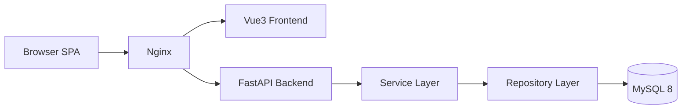
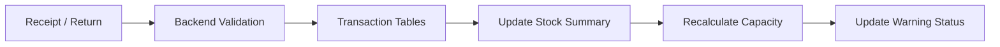
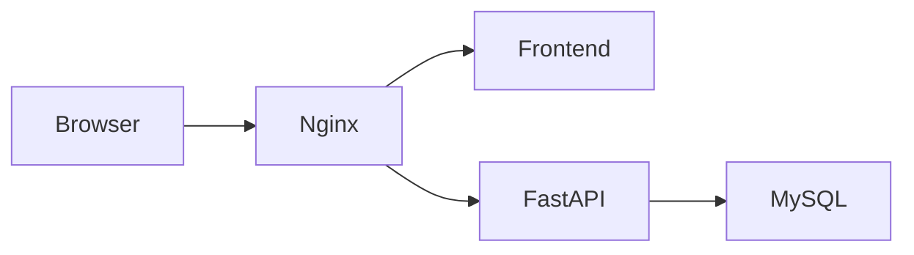

# ARCHITECTURE.md

# Fixture-M Lite Architecture

## 1. System Overview

Fixture-M Lite is a lightweight fixture inventory and production capacity management platform.

The system is designed for:

- Production fixture inventory control
- Production station planning
- Warehouse visibility
- Fixture demand management
- Stock warning management
- Fixture image management
- Fast search workflow

The Lite version intentionally avoids heavy lifecycle management logic.

---

## 2. System Goals

Primary goals:

- Easy to maintain
- Fast to develop
- Simple business logic
- Clear UI workflow
- Search-first experience
- Backend-driven architecture
- Production floor usability

---

## 3. High-level Architecture



---

## 4. Technology Stack

### Frontend

| Component | Technology |
|---|---|
| Framework | Vue 3 |
| Build Tool | Vite |
| Language | TypeScript |
| State Management | Lightweight reactive app state + composables |
| UI Style | Industrial Card UI |

### Backend

| Component | Technology |
|---|---|
| API Framework | FastAPI |
| Validation | Pydantic |
| ORM | SQLAlchemy |
| Auth | JWT |

### Database

| Component | Technology |
|---|---|
| Database | MySQL 8 |
| Migration | Alembic |

---

## 5. Frontend Architecture

```text
frontend/
├─ src/
│  ├─ components/
│  ├─ pages/
│  ├─ router/
│  ├─ utils/
│  ├─ api.ts
│  ├─ appState.ts
│  └─ styles.css
```

### Main frontend pages

```text
pages/
├─ InventoryPage.vue
├─ SearchWorkspacePage.vue
├─ MasterPage.vue
└─ ProductionPage.vue
```

---

## 6. Backend Architecture

```text
backend/
├─ app/
│  ├─ routers/
│  ├─ services/
│  ├─ repositories/
│  ├─ schemas/
│  ├─ models/
│  ├─ core/
│  └─ utils/
```

### Backend responsibilities

| Layer | Responsibility |
|---|---|
| Router | API endpoint and request handling |
| Service | Business logic and calculation |
| Repository | Database query and persistence |
| Schema | Request/response validation |
| Model | Database table mapping |

---

## 7. Core Modules

### 7.1 Master Data Module

Includes:

- Customers
- Fixtures
- Models
- Stations
- Owners

API prefix:

```text
/api/v2/master/*
```

---

### 7.2 Inventory Module

Includes:

- Receipt
- Return
- Inventory query
- Transaction history
- Export
- Stock summary
- Batch paste import for receipt/return
- On-the-fly fixture creation from pasted rows
- Similar-fixture confirmation before import
- Unified single identifier flow for all fixture transactions
- Free-form transaction number for each batch import

API prefix:

```text
/api/v2/inventory/*
```

#### Inventory UI behavior

The inventory page now supports one operational entry path and one overview path:

- Batch paste import from clipboard rows
- Transaction overview with direct CSV export using current filters

Batch paste import accepts rows in either of these practical formats:

- Two-line pairs:
  - `fixture-code-identifier`
  - `quantity`
- Delimited single lines from spreadsheets:
  - `fixture-code<TAB>identifier<TAB>quantity`
  - `fixture-code|identifier|quantity`

All imported rows are normalized into:

- `fixture_id`
- `ownership_type`
- `identifier`
- `quantity`

The frontend no longer asks users to pick or maintain:

- `manage_type`
- `serial_number`
- separate `datecode` vs `serial` entry flows

When the pasted fixture code does not exist:

- The UI prompts to create the new fixture
- If the user declines, the row is skipped

When the pasted fixture code is close to an existing fixture code:

- The UI asks the user to confirm whether it is the same fixture
- If confirmed, the row is replaced with the existing fixture
- If denied, the UI falls back to the add-or-skip decision

Batch import still uses the existing inventory transaction APIs:

- `POST /api/v2/inventory/receipts`
- `POST /api/v2/inventory/returns`

Fixture creation from the batch flow uses the master API:

- `POST /api/v2/master/fixtures`

Transaction query/export filters are unified as:

- transaction type
- date range
- fixture code
- transaction number
- identifier
- operator

---

### 7.3 Production Configuration Module

Includes:

- Model-station mapping
- Fixture requirements
- Capacity calculation

API prefix:

```text
/api/v2/production/*
```

---

### 7.4 Warehouse Module

Includes:

- Storage locations
- Fixture image management
- Location assignment
- Quick lookup

API prefix:

```text
/api/v2/warehouse/*
```

---

### 7.5 Search Module

Includes:

- Global search
- Fixture search
- Model search
- Search workspace for fixture/model drill-down

API prefix:

```text
/api/v2/search/*
```

---

## 8. Database Design Philosophy

Database responsibilities:

- Store data
- Maintain integrity
- Provide indexes
- Preserve transaction records

Business logic should not heavily depend on:

- Stored Procedures
- Triggers
- Giant Views

Acceptable database logic:

- FK
- UNIQUE
- INDEX
- NOT NULL
- updated_at trigger
- Basic integrity checks

---

## 9. Recommended Tables

### Core tables

```text
customers
users
user_customers

fixtures
machine_models
stations
owners

model_stations
fixture_requirements

material_transactions
material_transaction_items
audit_logs
```

---

### New tables

#### fixture_stock_levels

Stores:

- Minimum stock quantity
- Warning threshold
- Alert enable flag

#### fixture_stock_summary

Stores:

- Current stock quantity
- Returned quantity
- Last transaction time

#### storage_locations

Stores:

- Location code
- Area
- Rack
- Layer
- Description
- Optional image path

#### machine_capacity_summary

Stores:

- Model ID
- Station ID
- Maximum open station count
- Bottleneck fixture
- Calculation timestamp

#### fixture_images

Stores:

- Fixture ID
- Image path
- Thumbnail path
- Main image flag

---

## 10. Inventory Flow



Current transaction-item contract on the API surface:

```text
material_transaction_items
- fixture_id
- ownership_type
- identifier
- quantity
- note
```

Compatibility note:

- The database still retains legacy `manage_type`, `datecode`, and `serial_number` columns internally.
- The frontend and API surface have already been unified to a single `identifier`.
- Legacy columns are currently treated as an internal compatibility layer to avoid destructive migration.

---

## 11. Capacity Calculation

Formula:

```text
Maximum Open Station Count = MIN(stock_qty / required_qty)
```

Handled by:

```text
CapacityService
```

Example:

```text
T1_MAC requires:
- L-00062 x1
- L-00475 x1

Current inventory:
- L-00062 = 326
- L-00475 = 263

Maximum open station count:
min(326/1, 263/1) = 263
```

---

## 12. Stock Warning System

Rules:

```python
if stock_qty <= 0:
    status = "out_of_stock"
elif stock_qty < min_stock_qty:
    status = "low_stock"
else:
    status = "normal"
```

Displayed using:

- Red = Out of stock
- Orange = Low stock
- Green = Normal

---

## 13. Search-first UI

Global search is the core user entry point.

Search should support:

- Fixture code
- Fixture name
- Model code
- Station
- Storage location
- Identifier-based transaction lookup through the search workspace

Search result cards should display:

- Fixture image
- Fixture code
- Current stock
- Stock status
- Storage location
- Related models
- Maximum capacity summary

---

## 14. UI Layout Direction

Current layout direction:

```text
Left sidebar:
- Navigation
- Current customer
- Login / logout status
- Current time
- Recent audit summary

Content area:
- Search workspace / inventory / master / production
- Summary cards pinned near page top
- Detail panels scroll inside their own containers
```

Style direction:

```text
Industrial dashboard + modern card UI
```

---

## 15. Deployment Architecture



---

## 16. Suggested API Groups

```text
/api/v2/auth
/api/v2/master/customers
/api/v2/master/fixtures
/api/v2/master/models
/api/v2/master/stations
/api/v2/master/owners

/api/v2/inventory/receipts
/api/v2/inventory/returns
/api/v2/inventory/stock
/api/v2/inventory/transactions
/api/v2/inventory/alerts

/api/v2/production/model-stations
/api/v2/production/fixture-requirements
/api/v2/production/capacity

/api/v2/warehouse/locations
/api/v2/warehouse/fixture-images

/api/v2/search/global
/api/v2/audit/logs
```

---

## 17. Future Expansion

Possible future modules:

- Barcode scanning
- QR code lookup
- Mobile warehouse mode
- Fixture borrowing system
- Multi-warehouse support
- Notification center
- Excel import/export improvement

---

## 18. Final Positioning

Fixture-M Lite is positioned as:

```text
Production Fixture Warehouse + Capacity Platform
```

Core value:

- Know where fixtures are
- Know how many fixtures exist
- Know which models use them
- Know production capacity instantly
- Know shortage risks immediately
