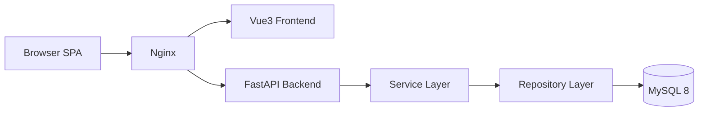
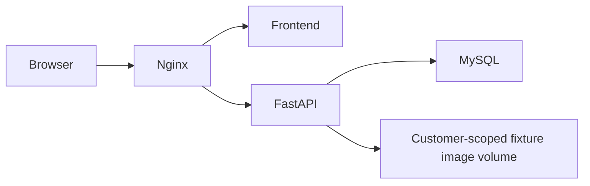

# ARCHITECTURE.md

# Fixture-M Lite Architecture

## 1. System Overview

Fixture-M Lite is a lightweight fixture inventory and production capacity management platform.

The system is designed for:

- Production fixture inventory control
- Production station planning
- Fixture location lookup
- Fixture demand management
- Stock warning management
- Optional file-based fixture image preview
- Fast search workflow
- Touch-friendly and keyboard-usable operational UI across shell, search, inventory overview, and master-data workspaces

The Lite version intentionally avoids heavy lifecycle management logic.

---

## 2. System Goals

Primary goals:

- Easy to maintain
- Fast to develop
- Simple business logic
- Clear UI workflow
- Search-first experience
- Backend-driven architecture
- Production floor usability

---

## 3. High-level Architecture



---

## 4. Technology Stack

### Frontend

| Component | Technology |
|---|---|
| Framework | Vue 3 |
| Build Tool | Vite |
| Language | TypeScript |
| State Management | Lightweight reactive app state + composables |
| UI Style | Industrial Card UI |

### Backend

| Component | Technology |
|---|---|
| API Framework | FastAPI |
| Validation | Pydantic |
| ORM | SQLAlchemy |
| Auth | JWT |
| App / Audit Logging | Python `logging` + rotating file handler |

### Database

| Component | Technology |
|---|---|
| Database | MySQL 8 |
| Migration | Alembic |

---

## 5. Frontend Architecture

```text
frontend/
├─ src/
│  ├─ components/
│  ├─ composables/
│  ├─ pages/
│  ├─ router/
│  ├─ utils/
│  ├─ api.ts
│  ├─ appState.ts
│  ├─ confirmState.ts
│  └─ styles.css
```

### Main frontend pages

```text
pages/
├─ SearchHomePage.vue
├─ InventoryRelationsPage.vue
├─ InventoryPage.vue
├─ SearchWorkspacePage.vue
├─ MasterPage.vue
└─ ProductionPage.vue
```

Current shared-component direction:

```text
components/
├─ UiAutocompleteInput.vue
├─ app/
│  ├─ AppTopbar.vue
│  ├─ AppMobileDrawer.vue
│  ├─ AppGlobalModals.vue
│  └─ AppReleaseNoticeModal.vue
├─ home/
│  ├─ FormUiSurface.vue
│  ├─ FormWorkspaceSwitcher.vue
│  ├─ FormReportOperations.vue
│  ├─ FormTransactionOperations.vue
│  ├─ FormProductionOperations.vue
│  ├─ FormMasterDataOperations.vue
│  ├─ FormRemoteAutocomplete.vue
│  ├─ FormProductionPasteImport.vue
│  └─ FormUserCustomerScopePicker.vue
├─ inventory/
│  ├─ BatchImportPanel.vue
│  ├─ ExportCenterPanel.vue
│  ├─ InventoryReportMobileCards.vue
│  ├─ InventoryOperationBoard.vue
│  └─ InventoryOverviewPanel.vue
├─ master/
│  ├─ FixtureQualityPanel.vue
│  ├─ FixtureQualityQuickEditModal.vue
│  ├─ MasterListPanel.vue
│  ├─ MasterDetailPanel.vue
│  ├─ MasterPermanentDeleteModal.vue
│  ├─ MasterReadonlySummary.vue
│  ├─ TransactionAccountListPanel.vue
│  └─ TransactionAccountDetailPanel.vue
├─ production/
│  ├─ ProductionHeaderSection.vue
│  ├─ ProductionCapacityPanel.vue
│  ├─ ProductionDetailSection.vue
│  └─ ProductionBatchImportModal.vue
├─ search/
│  ├─ FixtureOverviewPanel.vue
│  ├─ FixtureInfoPanel.vue
│  ├─ ModelInfoPanel.vue
│  ├─ FixtureEditForm.vue
│  ├─ ModelEditForm.vue
│  ├─ SearchHeroSection.vue
│  └─ SearchResultPanel.vue
└─ common/
   ├─ GuidedTour.vue
   ├─ InlineSpinner.vue
   ├─ OnboardingFlowPicker.vue
   └─ SystemConfirmDialog.vue
```

State and orchestration extracted from the largest frontend surfaces:

```text
composables/
├─ useConfigurationReportState.ts
├─ useInventoryBatchParser.ts
├─ useInventoryBatchPreviewState.ts
├─ useInventoryBatchSubmit.ts
├─ useMasterCrudActions.ts
├─ useMasterEntityDeletion.ts
├─ useMasterLedger.ts
├─ useMasterQuality.ts
├─ useProductionBatchImport.ts
└─ useProductionEditorState.ts

styles/surfaces/
├─ inventory-relations.css
├─ master.css
└─ production.css
```

Composable / helper notes:

- `frontend/src/composables/useProductionBatchImport.ts` now owns Production batch modal state, batch row lifecycle, and submit orchestration
- `frontend/src/composables/useProductionEditorState.ts` now owns Production editor state, autocomplete handlers, selection sync, and unsaved-change guards
- `frontend/src/utils/productionBatchImport.ts` holds pure parsing, similarity matching, row-state reduction, and CSV assembly rules for Production batch import
- `frontend/src/utils/productionStations.ts` holds the model-scoped station derivation used by Production overview/configure flows, so selectable stations stay limited to the current model's mapped station set
- `frontend/src/components/UiAutocompleteInput.vue` is the shared autocomplete input shell used by Production editing flows
- `frontend/src/pages/ProductionPage.vue` is kept as route-level orchestration plus data loading, route query sync (`model_id`, `return_to`), and leave/customer-switch guards, rather than carrying batch domain logic inline
- `frontend/src/pages/MasterPage.vue` now acts as route-level orchestration for route/tab state, customer scope, editor presentation, imports, and cross-feature navigation
- `frontend/src/components/master/MasterToolbar.vue` owns the responsive tab selector, overflow actions, and hidden import/image inputs; `useMasterCrudActions.ts`, `useMasterEntityDeletion.ts`, `useMasterLedger.ts`, and `useMasterQuality.ts` own CRUD, permanent deletion, ledger, and quality API orchestration respectively
- `FixtureQualityQuickEditModal.vue` and `MasterPermanentDeleteModal.vue` are independent modal components built on `UiModalShell.vue`
- `MasterPage.vue` keeps master records in a read-only summary state after selection; form state is populated only after the user explicitly enters edit mode
- below the phone breakpoint, `MasterPage.vue` renders KPI cards as one horizontally scrollable compact row, replaces the full tab strip with a grouped select, and consolidates low-frequency image/import/export/navigation actions under `更多操作`
- mobile master detail mode hides KPI and batch tool regions and keeps only the list return action, current record context, and the applicable edit action above the detail content
- `MasterReadonlySummary.vue` owns the reusable no-selection and selected-record summary presentation, while `MasterDetailPanel.vue` owns the edit/create form shell
- `InventoryReportMobileCards.vue` owns the compact mobile rendering of configuration-report rows and optional transaction details
- configuration-report page responses include `populated_columns`, calculated across the complete filtered result rather than the current page; the frontend intersects this with the user's saved column preference to hide empty columns without page-to-page layout drift
- configuration-report endpoints default `fixture_status` to `active`, allow `inactive` and `all`, and preserve fixture-less configuration-gap rows in the active view so missing mappings remain visible
- `frontend/src/confirmState.ts` and `SystemConfirmDialog.vue` provide the application-wide Promise-based confirmation flow; feature pages no longer call native `window.confirm`
- `frontend/src/components/common/UiModalShell.vue` owns shared modal accessibility behavior: dialog semantics, initial/return focus, focus trapping, Escape handling, nested-modal stacking, and background `inert`; application dialogs, onboarding flow selection, guided tours, release notices, production import/copy, Master quality quick-fix, and permanent deletion reuse it

Application shell notes:

- Login / guest entry is rendered in the root app shell before route content
- `/login` uses a lightweight route placeholder because the root shell owns authentication UI; successful login enters `/search`, and logout replaces the URL with `/login`
- all feature pages are route-level dynamic imports, so search, inventory, master-data, and production bundles load only when their route is entered
- `App.vue` is the system-surface controller for the two selectable surfaces: the default hybrid `WorkspaceSystemSurface.vue` and route-aware `FormSystemSurface.vue`
- Workspace UI always uses the Modern top bar. `/search` and `/inventory` render the Workbench three-column quick-operation surface without its duplicate embedded header; its fourth tab opens `/inventory/overview` as the transaction-only total view inside the frontline Workbench area, not as a management-backend module. After a fixture or model query, admins and super admins can use the pencil Edit action in the detail column to update the same fields as master-data maintenance in place; the shortcut reuses the existing scoped update APIs and participates in the shared unsaved-change guard. `/production/*` and `/master/*` render the canonical full-maintenance route pages. Modern and Workbench are no longer independently selectable; the former Modern shell template is archived in `doc/ui-backups/modern-ui-template-2026-08-31.md`
- Form UI owns one fixed report frame: the page heading, current-customer badge, function selector, condition panel position, result toolbar, and table position do not change. Selecting report, receipt/return import, transaction overview, production, or master maintenance only replaces the condition fields and table columns/cells inside that frame
- `InventoryRelationsPage.vue` remains mounted in heading-less shell mode for the configuration report. `FormReportOperations.vue` is now only the route-aware dispatcher; `FormTransactionOperations.vue`, `FormProductionOperations.vue`, and `FormMasterDataOperations.vue` own their domain state and API orchestration, while `styles/form-report-operations.css` and `utils/formOperations.ts` hold shared presentation and validation/export rules. High-volume Form read models use server-side 50/100-row pagination. Production result loading does not preload fixture/model/station masters: `FormRemoteAutocomplete.vue` requests at most 20 backend-filtered options after focus or input, with debounce and stale-response protection. Create and edit actions replace a table row with inputs instead of opening another page. `FormProductionPasteImport.vue` adds on-demand spreadsheet paste for two-column model/station mappings and four-column model/station/fixture/quantity requirements. Before persistence it calls customer-scoped preview endpoints that classify new, unchanged, conflicting, and invalid rows; changed requirement quantities show old/new values and require an explicit overwrite confirmation, while omitted bindings are never deleted. `FormImageMaintenance.vue` uses the paged fixture read model with 50/100-row page sizes. File-backed image-status filtering scans image filenames and applies the resulting code condition in the paged fixture query instead of materializing every fixture ORM row. `BatchImportPanel.vue` supplies the spreadsheet grid inside the same report-section styling
- The original `/search`, `/inventory`, `/production`, and `/master/*` routes remain canonical in all system surfaces. `FormSystemSurface.vue` maps each route to its report workspace and maps workspace/subtable changes back to stable URLs, including `/master/images`; Workbench daily modes use `workbench_mode=transaction|fixture|model`, with `transaction_type=receipt|return`. Legacy `workbench_mode=receipt|return` links are normalized into the combined transaction mode
- `HomeUiSurfaceSwitcher.vue` exposes only Workspace and Form. It is mounted in the Workspace top bar and injected into the Form heading. The current system surface is retained in `sessionStorage`; legacy `modern` and `workbench` values migrate to Workspace, while signed-in users can keep a per-account Workspace/Form default in `localStorage`
- `InventoryRelationsPage.vue` is report-only; `useConfigurationReportState.ts` owns route-query, draft/applied filters, paging query state, and full-result export, while the page coordinates report/options API loading and cross-section state
- `InventoryReportFilters.vue`, `InventoryReportResults.vue`, and `FixtureImageDialog.vue` own the report filter presentation, desktop/mobile results presentation, and customer-scoped image dialog lifecycle respectively
- `BatchImportPanel.vue` delegates parsing/inventory validation, preview aggregation, and submit/duplicate-confirmation state to `useInventoryBatchParser.ts`, `useInventoryBatchPreviewState.ts`, and `useInventoryBatchSubmit.ts`
- large page CSS is stored in `frontend/src/styles/surfaces/inventory-relations.css`, `master.css`, and `production.css`; the SFCs retain the original global/scoped style semantics through external style blocks
- every role defaults to Workspace UI; signed-in users can persist Workspace or Form as a per-account system-surface default in browser `localStorage`
- `/search/detail` remains a direct compatibility route for fixture/model search, onboarding, and cross-page return links
- `/inventory` remains the operation-focused receipt/return page
- `/inventory/overview` remains a full-page route; in Workspace its primary and only quick-operation entry is the fourth frontline Workbench tab, and it is not duplicated in the top-bar `更多功能` menu
- `MasterPage` tabs now map to explicit routes: `/master/fixtures`, `/master/models`, `/master/stations`, `/master/customers`, `/master/users`, `/master/ledger`, `/master/quality`
- `/storage` is the dedicated fixture-storage index route across system surfaces. It registers comma-separated location codes, groups codes into optional containers, and edits fixture placement quantities; guest sessions retain read-only access.
- Modern `MasterPage` user maintenance includes the customer multi-select in its create/edit flow, requires at least one selected customer on save, preserves the current selection during activation changes, and labels legacy empty assignments as unassigned
- master-data list panels now surface `current page / total pages / total rows` and paging actions above the list table, instead of below it
- guest users do not see `資料維護`, and router guard blocks direct `/master` access
- the current shell is a top bar rather than a left sidebar
- the top bar surfaces login state, customer switch, today receipt/return totals, and low-stock count
- top-bar summary data now comes from a dedicated backend dashboard-summary endpoint, rather than front-end derivation from a recent transaction slice
- the top bar provides primary `收/退料`, `匯出中心`, and `Modern UI 教學` actions
- `更多功能` omits the duplicate fixture/model query entry because both query and report are directly available from `/search`
- clicking the logo returns to `/search`
- `MasterPage` provides a local `返回搜尋` action, while `ProductionPage` can render `返回搜尋` or `返回來源` depending on the incoming `return_to` route query and falls back to `/search`
- auth session and selected customer are restored from `sessionStorage` on reload, rather than waiting for a fresh login
- authenticated `401` responses are handled once in the shared API transport: session state is cleared, the current internal full path is saved, the shell returns to `/login`, and a successful login consumes that path to resume the interrupted page; unauthenticated login failures remain ordinary API errors
- `unsavedChangesGuard.ts` is the shared dirty-state registry. Registered drafts block customer changes, system-surface changes, route navigation, and logout through the application confirmation flow, and also register a native `beforeunload` warning for refresh or tab close
- the desktop top bar uses one compact, non-wrapping row on wide screens; below `1600px` it switches to the compact header that keeps the menu trigger, current-customer context, and receipt/return shortcut visible while lower-frequency actions remain in the drawer
- top-bar daily metrics now use click/tap popovers with keyboard close behavior, rather than hover-only disclosure
- low-stock popover rows now expose a direct `收 / 退料` quick action that opens the shared batch modal with the fixture code prefilled
- guest sessions keep inventory quick actions hidden in fixture detail and low-stock popovers, instead of surfacing buttons that would only fail after click
- mobile layout keeps a persistent hamburger trigger plus current customer name, with non-essential controls collapsed into the menu
- the mobile drawer is now a scrollable panel with a sticky header, and primary actions are placed ahead of summary stats
- mobile drawer also exposes `Modern UI 教學`, so onboarding replay is not tied to the search page alone
- the root shell owns one surface-aware onboarding picker: Modern UI, Form UI, and Workbench UI open it from separate entries, and the picker only lists the concise and complete-detailed flows for the selected surface
- Workbench onboarding has signed-in and guest quick/detailed flows. Route-aware steps can open its fixture/model query, combined receipt/return input, center results, Workbench-sized batch panel, and role-appropriate management navigation without leaking Form UI targets. Admin detailed steps also target the dedicated Workbench ledger and fixture-quality result areas
- Form UI includes signed-in and guest concise/detailed flows; its Admin quick guide also documents the searchable multi-customer access selector used by user maintenance
- the signed-in Form detailed flow pairs every visible workspace button with the route and page it opens; Admin ledger/quality steps and Super-Admin customer/user steps are filtered by their separate capabilities. Report coverage includes linked filters, transaction filters, capacity, column presets, result interpretation, image access, export, and pagination. Receipt/return coverage explains each spreadsheet column, compact/full paste formats, preview resolution, and sandboxed submission. Master-data coverage walks fixture, model, station, customer, and user tables. Production coverage explicitly teaches model-station binding first, then model-station-fixture requirements, capacity interpretation, and both paste-import formats
- `FormUserCustomerScopePicker.vue` is shared by Modern and Form user maintenance and owns the user-access multi-select interaction: selected count and chips, code/name search, individual checkboxes, select-all-visible, clear-all, and at-least-one validation feedback
- paged user responses include compact `allowed_customers` labels so Form UI does not preload the full customer master merely to render access names; opening or searching the picker requests only a 50-row customer option page while preserving the selected summaries
- onboarding state is stored in lightweight reactive app state and uses route-aware step syncing
- signed-in onboarding includes a dedicated seven-step configuration-report flow as well as report steps in the complete detailed guide
- guest onboarding also opens the picker instead of auto-starting a fixed flow: it offers the seven-step `查詢工作台與庫存配置報表` quick guide and an 18-step complete read-only guide
- the guest picker distinguishes signed-in daily operations, Admin ledger/data-quality tools, and Super-Admin customer/user management
- onboarding steps may provide route query requirements, allowing the existing guided flows to switch `/search` between Modern/Form surfaces; legacy `home_mode=query|report` remains accepted alongside canonical `ui_surface=modern|form|workbench`
- onboarding captures the launch `fullPath`; finishing or closing a tour restores the exact pre-tour route and report filters instead of clearing query state
- `SearchHeroSection.vue` owns the versioned landing-page release disclosure, with copy defined in `frontend/src/releaseNotice.ts`; the disclosure is explicitly collapsed until opened

---

## 6. Backend Architecture

```text
backend/
├─ app/
│  ├─ routers/
│  ├─ services/
│  ├─ repositories/
│  ├─ schemas/
│  ├─ models/
│  ├─ core/
│  └─ utils/
```

### Backend responsibilities

| Layer | Responsibility |
|---|---|
| Router | API endpoint and request handling |
| Service | Business logic and calculation |
| Repository | Database query and persistence |
| Schema | Request/response validation |
| Model | Database table mapping |
| Middleware | Cross-cutting request audit logging |

---

## 7. Core Modules

### 7.1 Master Data Module

Includes:

- Customers
- Fixtures
- Models
- Stations
- Customer-to-user assignment
- Fixture responsible-user assignment
- Reversible active/inactive state management for fixtures, models, stations, and users
- Admin/Super-Admin transaction ledger workspace for inventory case review, reversal, and customer-scoped stock-state recovery
- The transaction ledger now uses server-side transaction paging (`page / page_size / total`) and backend-side filtering by transaction number, operator, fixture, and type, rather than trimming to a recent in-memory slice
- The admin ledger transaction-id paging subquery is intentionally ordered by `material_transactions.id desc`; this keeps the MySQL `DISTINCT` query valid and avoids `500` errors when loading `/api/v2/inventory/admin/transactions`
- Admin/Super-Admin fixture data-quality workspace for integrity review of master data, image coverage, model linkage, and stock consistency
- Customer-scoped fixture image upload, preview, and batch upload. Files live at `FIXTURE_IMAGE_DIR/<customer_id>/<fixture_code>.<ext>`; the authenticated GET route requires `customer_id` and applies the same assigned-customer scope as other master-data reads
- Pre-scope flat image files remain read-compatible only when the fixture code is globally unique. A duplicated cross-customer code never receives a shared legacy image
- Fixture-code changes move the image with rollback if the database transaction fails; permanent fixture deletion removes only that customer's image after the database commit succeeds
- The quality workspace presents only fixture code, storage location, minimum stock, model linkage, and image columns. Storage and minimum-stock issues support inline correction, while missing linkage and image issues route to their targeted repair flows
- Admin/Super-Admin permanent fixture deletion with an explicit preserve/delete transaction-history choice
- Admin/Super-Admin permanent model deletion with an explicit warning that related model-station mappings, fixture requirements, and affected capacity summaries will be removed together
- Admin/Super-Admin permanent station deletion with an explicit warning that related model-station mappings, fixture requirements, and affected capacity summaries will be removed together
- Master-data desktop layout now keeps list/detail split view down to about `1100px`; phone-width flow switches to `list -> detail` instead of long stacked scrolling
- Master-data list rows are keyboard-operable and focusable, not mouse-only table rows

API prefix:

```text
/api/v2/master/*
/api/v2/storage/*
```

---

### 7.2 Inventory Module

Includes:

- Receipt
- Return
- Inventory query
- Transaction history
- Export
- Report export (`xlsx` / `txt`) and preview
- Stock summary
- Batch paste import for receipt/return
- A spreadsheet-style entry grid combines quick entry and bulk paste in the same fixed fixture/identifier/quantity columns; it feeds the existing batch draft and preview pipeline without introducing a separate single-transaction API path
- Return-mode parse-time inventory precheck against identifier stock summary
- On-the-fly fixture creation from pasted rows
- Similar-fixture confirmation before import
- Unified single identifier flow for all fixture transactions
- Free-form transaction number for each batch import
- Transaction number is an explicit business-required field for receipt/return creation; the backend no longer auto-generates fallback numbers, so duplicate-transaction protection always evaluates the operator-supplied number
- Historical transaction reads still tolerate legacy rows where `transaction_no` is `NULL` or blank; read models expose that field as nullable and the UI renders those cases as `（無單號）`
- Batch import now uses a single batch-level `ownership_type` selector; operators choose `customer_supplied` or `self_purchased` once per batch instead of per row
- Inventory ownership balances are derived from transaction items:
  - `customer_supplied_qty = customer-supplied receipts - customer-supplied returns`
  - `self_purchased_qty = self-purchased receipts - self-purchased returns`
  - `stock_qty = customer_supplied_qty + self_purchased_qty`
- Returnable quantity is validated independently for each `fixture + identifier + ownership_type`, so one ownership source can never be returned against another source's balance
- Receipt/return writes derive the operator from the authenticated session user. `material_transactions.actor_user_id` stores the stable user reference and `created_by` stores the display-name snapshot; request payloads, CSV rows, and import query parameters cannot override either value
- Stock, alert, identifier-stock, and fixture-context responses expose total, customer-supplied, and self-purchased quantities
- UI-visible inline row errors and toast feedback for failed inventory submissions
- Preview-time `current stock` and `post-transaction stock` columns for each identifier row
- In-batch sequential stock preview for repeated `fixture + identifier` rows
- Two-minute duplicate-submission guard for same user + same transaction signature
- Shared batch-import UI used by both `/inventory` and the global shell modal
- Admin transaction reversal with full customer-scoped stock recomputation
- Admin one-click inventory-state rebuild from persisted transaction items
- Inventory overview filters now use a primary + advanced split with responsive `4 / 3 / 2 / 1` column behavior, instead of collapsing to a single long column too early

API prefix:

```text
/api/v2/inventory/*
```

#### Inventory UI behavior

The inventory page now supports one operational entry path and one overview path:

- Batch paste import from clipboard rows
- Transaction overview with in-page filtering only; history export is handled through the shared export flow rather than an overview-page CSV action

Current layout direction for inventory entry points:

- `/inventory` keeps the full operation workspace route
- the global top-bar `收/退料` button opens a modal that exposes only the shared batch-import flow
- Workspace and Form account areas expose the same current-user password-change dialog; the backend verifies the current password before replacing it
- the global top-bar `匯出中心` button opens a modal that centralizes dataset, format, and range selection
- the export-center dataset list is role-aware, so Admin/Super-Admin exports such as `治具資料品質` are hidden from guest/user sessions instead of failing late with `403`
- transaction-detail exports can narrow custom scope by `customer_supplied` or `self_purchased`; export preview and the final report share the same backend item-level filter
- filter and export categories that can be combined use the shared checkbox multi-select. Repeated query keys represent OR within a category (`transaction_type=receipt&transaction_type=return`), while independent categories continue to combine with AND; scalar requests remain accepted for existing clients
- the global modal intentionally excludes stock overview, low-stock panel, and recent-transaction panels
- the shared batch modal can be opened with a preset fixture code from other pages, so the operator only needs to fill `identifier` and quantity for the next row
- preset-fixture entry pre-fills the fixture column in blank grid rows, so the operator can continue typing identifiers and quantities or paste a multi-row table in the same surface
- closing the shared batch modal now uses a single confirmation path for `關閉` / `Esc` / `收退料總檢視`, so unsent drafts are not silently discarded
- the shared batch modal also persists its draft in `sessionStorage` per customer, so reopening the modal can restore an unfinished batch
- the batch source selector intentionally resets to `customer_supplied` after clear, submit, or reopen; unfinished draft restore does not carry over a previous `self_purchased` choice
- after a successful modal submission, the input is cleared but the modal stays open for consecutive batches
- tutorial mode can run the batch-import UI without writing official inventory transactions, for onboarding use only
- `InventoryBatchEntryGrid.vue` provides direct cell editing, row insertion/removal, fixture autocomplete, Enter-to-next-row navigation, and multi-row/multi-column clipboard paste from Excel or other tables
- `inventoryBatchClipboard.ts` recognizes fixed three-column ranges, two-column tables whose first column combines `fixture-identifier`, equivalent Markdown pipe tables, legacy vertical pairs, and header-driven wider tables; wide-table import extracts only fixture code, datecode/serial, and the matching quantity column while ignoring unrelated date/name/description columns
- onboarding selectors that target inventory controls inside the global modal must be scoped under the modal container, because some `data-tour` names are reused in the full `/inventory` page layout
- ready rows that resolve to the same `fixture + identifier` are merged before submit, so the final payload matches the previewed accumulated quantity
- grid edits serialize to the same tabular batch draft consumed by the existing parser; identifier normalization, similar/missing-fixture handling, return-stock checks, duplicate merging, and API submission remain in the shared batch pipeline
- `/inventory/overview` now uses a paginated detail-row contract with route-synced filters, page state, and optional `return_to` back-navigation context

Batch paste import accepts rows in either of these practical formats:

- Two-line pairs:
  - `fixture-code-identifier`
  - `quantity`
- Delimited single lines from spreadsheets:
  - `fixture-code<TAB>identifier<TAB>quantity`
  - `fixture-code|identifier|quantity`

All imported rows are normalized into:

- `fixture_id`
- `ownership_type`
- `identifier`
- `quantity`

Identifier rule:

- only pure-numeric `identifier` values with length `1-4` trigger strict normalization and are left-padded to 4 digits before write
- numeric values longer than 4 digits are treated as legacy values and stored as-is
- non-pure-numeric values are treated as legacy values and stored as-is
- transaction query / export filters reuse the same rule through a shared backend utility, so write-time normalization and query-time matching stay aligned

The frontend no longer asks users to pick or maintain:

- `manage_type`
- separate legacy identifier categories

Display wording rule:

- UI copy may present `identifier` as `datecode/編號`
- API, schema, and database contracts still stay on `identifier`
- frontend write-side normalization is centralized in `frontend/src/utils/identifier.ts`, so batch-import parsing does not duplicate the short-numeric padding rule

When the pasted fixture code does not exist:

- The UI prompts to create the new fixture
- If the user declines, the row is skipped

When the pasted fixture code is close to an existing fixture code:

- The UI asks the user to confirm whether it is the same fixture
- If confirmed, the row is replaced with the existing fixture
- If denied, the UI falls back to the add-or-skip decision

Batch import still uses the existing inventory transaction APIs:

- `POST /api/v2/inventory/receipts`
- `POST /api/v2/inventory/returns`
- `GET /api/v2/inventory/dashboard-summary`

Duplicate-submission behavior:

- the backend compares recent submissions within a 2-minute window
- the duplicate signature is: same user, same transaction type, same transaction number, and the same set of `fixture + identifier + quantity + ownership_type` items
- when a duplicate is detected, the API returns a conflict message asking the user to confirm whether to resend
- the frontend surfaces that message as a confirmation prompt before retrying with `confirm_duplicate=true`
- even after confirmation, `transaction_no` remains unique; reusing the same transaction number still returns a validation error instead of creating a second record

Preview behavior:

- the batch preview table now shows `current stock` and `post-transaction stock` for each row
- preview stock is calculated at the `fixture + identifier` level
- repeated rows for the same `fixture + identifier` are accumulated in display order so the preview matches final submission order

Admin repair / rollback flows use:

- `DELETE /api/v2/inventory/admin/transactions/{transaction_id}`
- `GET /api/v2/inventory/admin/transactions`
- `POST /api/v2/inventory/admin/recalculate`

Fixture creation from the batch flow uses the master API:

- `POST /api/v2/master/fixtures`

Transaction query/export filters are unified as:

- transaction type
- date range
- fixture code
- transaction number
- identifier
- operator

Date handling rule:

- All user-facing dates across inventory, master data, production, search, and reports are day-granularity only
- API responses and CSV exports expose dates as `YYYY-MM-DD`
- Transaction creation and CSV import normalize incoming datetime-like values to the transaction date before persistence
- Technical timestamps remain available internally for audit ordering and duplicate-submission protection, but the UI never renders their hour, minute, or second components

---

### 7.3 Production Configuration Module

Includes:

- Station settings for model-to-station applicability
- Fixture requirements
- Capacity calculation
- Station-scoped model query
- Batch paste import with similarity confirmation
- Shared-station multi-model support
- Creating or updating a fixture requirement now auto-creates the underlying model-station relationship when it does not exist yet
- Page-level orchestration with extracted editor-state and batch-import composables
- Dual-mode Production workspace: `/production` for overview, `/production/mapping` and `/production/requirements` for the shared configure workspace
- Client-side station selection is derived from current `model_stations` only, so overview and requirement flows do not default to customer stations that are not mapped to the selected model

API prefix:

```text
/api/v2/production/*
```

#### Production domain rule

The production module now treats:

- `model` as the top-level planning unit
- `station` as a reusable route marker
- `fixture requirement` as a resource rule bound to `model + station`

This means:

- Multiple models may share the same station
- The same station may require different fixtures for different models
- The same fixture may be reused across multiple stations or models
- Capacity calculation must never infer model from station alone

Authoritative requirement scope:

```text
model_id + station_id + fixture_id
```

#### Production UI behavior

- `/production` is the overview surface for station scan + bottleneck drill-down
- `/production/mapping` and `/production/requirements` currently converge into the same configure workspace, rather than separate editing pages
- the selected model is mirrored into route query `model_id` so cross-page handoff and refresh keep the same planning context
- `return_to` is preserved in route query and drives the local back button label / target
- unsaved mapping or requirement edits participate in browser unload, route leave, and customer-switch confirmation guards
- default and selectable requirement stations are always derived from the selected model's mapped station set; capacity and model-query refreshes must not target unmapped customer stations
- the configure workspace uses `站點設定` as the primary operator-facing label for model-station mappings, while backend contracts remain on `model_stations`
- the configure workspace is a responsive master-detail flow: select a model, select a mapped station, then configure that station's fixture requirements
- model and station context are inherited by child editors instead of being entered repeatedly; new editors start blank instead of preselecting the first station or fixture
- mapped stations remain visible even before fixture requirements exist, and are marked as waiting for configuration rather than disappearing from the overview
- requirement edits show a client-side projected maximum-station count before submission; the backend calculation remains authoritative after save
- each `model + station + fixture` requirement can enable designated mode and select one or more currently in-stock identifiers for that fixture; selected identifiers are normalized with the shared identifier rules and persisted independently from transaction history
- designated requirements calculate available quantity and capacity from only their selected identifiers; non-designated requirements continue to use the fixture's complete stock quantity, and an assigned identifier that later reaches zero remains visible but contributes zero stock
- a station's complete fixture-requirement set can be copied to another station in the same model or to a station in another model
- copy is transactional and safe by default: existing target fixtures are skipped unless the operator explicitly enables overwrite; an unmapped target station is added to the target model in the same transaction
- copy results report created, updated, skipped, and mapping-created counts, and the UI navigates directly to the target context after success
- production routes, production menu entries, and query-to-production actions are hidden from guest sessions; direct guest navigation is redirected to `/search?home_mode=report` with an explanatory toast

---

### 7.4 Search Module

Includes:

- Query/report mode switching as the primary `/search` entry
- Subject switching between fixture, station, and model views
- Route-synchronized relation filters and pagination
- Global search
- Fixture search
- Model search
- Paginated search result contract with `page` / `page_size`
- Search workspace for fixture/model drill-down
- Deferred fixture / model context loading after result selection
- Embedded fixture/model maintenance panels inside search results
- Search-to-production handoff for model-focused capacity work
- Search result panel auto-scroll after successful search, aligned with the current hero height

API prefix:

```text
/api/v2/search/*
```

The inventory/configuration report has a dedicated backend read model instead of assembling six complete datasets in the browser:

- `GET /api/v2/inventory/configuration-report` performs filtering, sorting, summary aggregation, and bounded pagination.
- `GET /api/v2/inventory/configuration-report/options` returns priority-aware linked filter options.
- `GET /api/v2/inventory/configuration-report/export` streams every matching row as CSV or XLSX and is not limited to the current page.
- Shared CSV helpers and the explicit XLSX renderers escape string cells that begin with `=`, `+`, `-`, or `@` by adding a leading apostrophe; numeric cells retain their numeric type.

`ConfigurationReportRepository` builds a relation-level union of configured requirements, unbound fixtures, unconfigured model/station mappings, unmapped models, and unmapped stations. A configured fixture therefore appears once per matching model/station requirement rather than being collapsed into a primary-entity row. The repository also joins stock-water state and transaction-derived customer-supplied/self-purchased balances. Configured rows calculate `max_open_station_count` with a model/station window over the complete requirement set, so a later fixture filter cannot hide the true bottleneck. Fixture status, water status, configuration status, transaction direction, and ownership source accept repeated values; each category expands to an SQL `IN`/`EXISTS` OR set, with date and other categories applied as AND conditions. Two composite indexes support the report's transaction lookup paths. The frontend requests only the current server page plus linked options; the explicit capacity action and fixture-image action continue to use their existing authoritative endpoints.

---

### 7.5 Audit Module

Includes:

- Database-backed business audit records in `audit_logs`
- File-backed append-only audit records in `logs/audit.log`
- Request-level audit capture for all HTTP API calls
- Domain-level audit capture for business actions that already call `AuditService.record()`

API prefix:

```text
/api/v2/audit/*
```

Audit logging behavior:

- every HTTP request that reaches the FastAPI app is written as `request_audit`
- existing business audit events are also mirrored to the same file as `domain_audit`
- the audit file is line-delimited JSON, so each log line is a standalone event
- the file logger uses rotation to avoid unbounded single-file growth

Current request-audit payload includes:

- `timestamp`
- `actor.mode`
- `actor.user_id`
- `actor.username`
- `actor.display_name`
- `actor.role`
- `request.method`
- `request.path`
- `request.query`
- `request.client_ip`
- `response.status_code`
- `response.duration_ms`
- `error`

---

## 8. Database Design Philosophy

Database responsibilities:

- Store data
- Maintain integrity
- Provide indexes
- Preserve transaction records

Business logic should not heavily depend on:

- Stored Procedures
- Triggers
- Giant Views

Acceptable database logic:

- FK
- UNIQUE
- INDEX
- NOT NULL
- updated_at trigger
- Basic integrity checks

---

## 9. Recommended Tables

### Core tables

```text
customers
users
user_customers

fixtures
machine_models
stations

model_stations
fixture_requirements
fixture_requirement_identifiers

material_transactions
material_transaction_items
fixture_stock_levels
fixture_stock_summary
machine_capacity_summary
audit_logs
```

Important table-level rules:

- `fixtures` uses `(customer_id, code)` as the authoritative unique key
- `machine_models` uses `(customer_id, code)` as the authoritative unique key
- `stations` uses `(customer_id, code)` as the authoritative unique key
- `fixtures.responsible_user_id` points to `users.id` and is nullable
- customer assignment for normal users is represented by `user_customers`
- `fixture_requirements.designated_mode` controls whether capacity uses all fixture stock or only identifier values stored in `fixture_requirement_identifiers`; identifier choices do not move ownership or stock

File-based audit note:

- `audit_logs` remains the structured database table for business-level audit history
- `logs/audit.log` is the broader operational audit trail that also captures read/query/export/login-style request activity

---

### Supporting tables

#### fixture_stock_levels

Stores:

- Minimum stock quantity
- Warning threshold
- Alert enable flag

#### fixture_stock_summary

Stores:

- Current stock quantity
- Returned quantity
- Last transaction time

#### machine_capacity_summary

Stores:

- Station ID
- Maximum open station count
- Bottleneck fixture code
- Cache timestamps (`created_at`, `updated_at`)

Note:

- This table is now treated as optional cache-style summary data only.
- The authoritative runtime calculation is performed from `fixture_requirements` scoped by `model_id + station_id`.
- UI and API no longer expose a derived `current_open_station_count`.

## Customer Access Scope

- authenticated `super_admin`, `admin`, and `user` sessions can only see customers assigned in `user_customers`.
- `manage` and `super_manage` permissions do not bypass customer scope; management operations remain limited to assigned customers where a concrete customer is required.
- `guest` can see all customers, but stays read-only.
- authenticated customer-scoped APIs reject unassigned customers and require `customer_id` whenever the endpoint needs a concrete scope.
- customer assignment is edited from the `customer` maintenance tab, not from the `user` tab.
- users assigned to a customer are also the selectable responsible-person candidates for that customer's fixtures.

## Role Matrix

### super_admin

- Customer visibility: only customers assigned in `user_customers`
- Data edit: allowed
- Master page access: allowed
- Customer management: allowed
- User management: allowed
- Transaction-ledger management: allowed
- Fixture-quality management: allowed

### admin

- Customer visibility: only customers assigned in `user_customers`
- Data edit: allowed
- Master page access: allowed
- Customer management: not allowed
- User management: not allowed
- Transaction-ledger management: allowed
- Fixture-quality management: allowed

### guest

- Customer visibility: all customers
- Data edit: not allowed
- Master page access: not allowed
- Customer management: not allowed
- User management: not allowed

### user

- Customer visibility: only customers assigned in `user_customers`
- Assigned customer count: may be `0` at creation time, then assigned from customer maintenance
- Data edit: allowed, but only within assigned customers
- Master page access: allowed
- Customer management: not allowed
- User management: not allowed

## Permission Model

- Persisted signed-in user roles accepted by the create/update API are `super_admin`, `admin`, and `user`; `guest` exists only as a guest-mode session and is never a persisted login role
- `read`
  - `super_admin`, `admin`, `user`, and `guest` can use read-only APIs
- `write`
  - `super_admin`, `admin`, and `user` can create/update/import business data
  - `guest` is always read-only; the backend rejects write access for any signed-in session whose role is outside the valid persisted-role set
- `manage`
  - `super_admin` and `admin` can manage transaction ledgers, fixture quality, and existing admin-level destructive master-data actions
- `super_manage`
  - only `super_admin` can create/update customers and manage users
- every signed-in role can change its own password after confirming the current password; only `super_admin` can reset another user's password

Current master-data write scope:

- `fixtures`
- `machine_models`
- `stations`
- `fixture quality` report and review

Current Admin/Super-Admin scope:

- transaction ledger
- fixture quality

Current Super-Admin-only scope:

- `customers`
- `users`, including other-user password reset

Frontend rule:

- guest mode does not show the `資料維護` navigation entry
- direct navigation to `/master` is redirected away for guest mode
- current customer, login state, date, and today summary are surfaced in the top bar; mobile navigation uses the drawer overlay
- `資料維護` can surface inactive fixtures/models/stations/users through status filters
- inactive fixtures/models/stations/users can be restored from the same maintenance workflow

## 10. Inventory Flow


Current transaction-item contract on the API surface:

```text
material_transaction_items
- fixture_id (nullable after fixture deletion)
- deleted_fixture_code
- deleted_fixture_name
- ownership_type
- identifier
- quantity
- note
```

Storage note:

- The database contract is now centered on a single `identifier` column.
- The frontend and API surface use the same `identifier` field end to end.
- backend normalization and query expansion for `identifier` are centralized in `backend/app/utils/identifier_rules.py`

---

## 11. Capacity Calculation

Formula:

```text
Maximum Open Station Count = MIN(stock_qty / required_qty)
```

Handled by:

```text
CapacityService
```

Final business definition:

```text
For a given model + station:
in the "open only this station" scenario,
maximum open station count =
the minimum of floor(available stock / required_qty)
across all fixtures required by that model at that station
```

Important constraints:

- Do not calculate across all stations of the model
- Do not calculate "after T1 opens, how many T2 remain"
- Do not infer fixture requirements by station alone
- Do not deduct stock between different stations during this single-station capacity query

Lookup rule:

```sql
WHERE model_id = ?
  AND station_id = ?
```

Example:

```text
T1_MAC requires:
- L-00062 x1
- L-00475 x1

Current inventory:
- L-00062 = 326
- L-00475 = 263

Maximum open station count:
min(326/1, 263/1) = 263
```

Example interpretation using the current metaphor:

- `Model` = car
- `Station` = road segment / route marker
- `Fixture requirement` = resources that a specific car needs when passing that road

You cannot determine the car just by looking at the road.
You must always know both:

- which car
- which road

before deciding the required fixtures and capacity.

---

## 12. Stock Warning System

Rules:

```python
if stock_qty <= 0:
    status = "out_of_stock"
elif stock_qty < min_stock_qty:
    status = "low_stock"
else:
    status = "normal"
```

Displayed using:

- Red = Out of stock
- Orange = Low stock
- Green = Normal

---

## 13. Search-first UI

The application provides two directly switchable system surfaces:

- `workspace`: the default surface, with the Modern top bar, frontline Workbench quick operations on `/search` and `/inventory`, its transaction-only total view on `/inventory/overview`, and full maintenance pages on production/master routes
- `form`: the fixed report/table workspace for query, receipt/return, production, master-data, image, ledger, and quality operations
- Workbench management tool panels expose one shell-owned filter collapse state. Teleported condition grids follow the right-panel state while selected image, ledger detail, and row editors remain visible. `UiMultiSelect.vue` visually hides native checkboxes and presents text-only option rows with selected color/background, preserving native input semantics for keyboard and assistive technology.
- every role defaults to `workspace`; signed-in users can persist `workspace` or `form` as their per-account login default
- `ui_surface=workspace|form` is the canonical surface state. Legacy `modern` and `workbench` values resolve to Workspace; `home_mode=query|report` remains accepted for existing links and onboarding compatibility
- `appState.ts` owns the latest Modern UI query-workspace handoff state (`mode`, visible draft, committed query, selected result id); `App.vue` maps the state when switching `/search` between system surfaces, while all other routes retain their current functional location
- a draft that differs from the last committed search is transferred to report as a keyword and preserved separately as `query_draft`, preventing a stale selected id from overriding what the user currently sees in the input

Report mode behavior:

- fixture, model, and station remain ordinary linked filters; an empty value means all values for that filter
- does not expose separate primary-view buttons, `無` selectors, `basis`, or `report_dimension`; result, summary, pagination, and export all use relation-detail rows, so one fixture can appear more than once when it has multiple model/station relationships
- consumes the backend configuration-report read model rather than loading complete fixture, model, station, mapping, requirement, stock, and transaction collections
- exposes total, customer-supplied and self-purchased stock plus model/station maximum-open-station capacity as normal report/export columns
- provides `現場庫存`, `配置檢查`, and `完整報表` column presets; users can still customize individual columns and the choice remains browser-local
- uses the application top bar as the single customer selector; the report panel filters by keyword, fixture, model, station, water status, storage, transaction direction, ownership source, and transaction date
- links filter choices in user-selection order: the first active field is the priority anchor, later selectors are narrowed by preceding fields, and later choices do not remove options from the anchor
- clears a later select automatically only when a changed higher-priority condition makes that selection invalid
- keeps draft and applied conditions explicit: changed fields show an unapplied-condition count, the table continues to label its last applied conditions, and capacity calculation is disabled until the same draft has been applied
- starts with the full filter panel collapsed on mobile, preserving keyword input, a `更多條件` action, applied-condition context, and the current result summary
- no longer exposes low-stock, unconfigured, today-receipt, or today-return one-click cards; those conditions remain available through the normal filter controls on desktop and mobile
- keeps `customer`, `q`, `fixture_status`, `fixture`, `model`, `station`, `water`, `storage`, `configuration`, `priority`, `page`, and `page_size` in route query state
- requests a bounded 50- or 100-row server page on desktop; mobile defaults to 20 and offers 20/50, while both layouts support previous/next navigation plus direct page jumps
- keeps the mobile result summary and applied-condition strip sticky below the application top bar, using horizontal overflow instead of increasing the fixed vertical footprint
- displays every report column by default and lets guests hide or restore individual columns; at least one column remains visible and the preference is persisted in browser `localStorage`
- delegates CSV/XLSX generation to the backend, exporting all rows matching the currently applied filters without pagination limits while including only currently visible columns
- export completion remains visible in the report with exported row count, visible-column count, and filename
- enables maximum-open-station calculation once a model is selected: `all stations` uses the authoritative model query and renders every mapped station, while a selected station uses the authoritative single-station capacity endpoint
- keeps each station's bottleneck fixture collapsed by default and expands it independently on demand
- supports `today receipt`, `today return`, `date-range receipt`, and `date-range return` through server-side transaction predicates; date and ownership values are ignored unless a direction-bearing transaction mode is active
- can reveal matching item-level details for only the fixtures on the current page, including direction, ownership source, date, transaction number, identifier, and quantity
- renders a fixture's nested transaction details only beneath its first row on the current page, preventing repeated history blocks when one fixture has multiple model/station configurations
- when transaction details are enabled, backend CSV/XLSX export appends six detail columns across the complete filtered result set and expands each fixture's transactions only once while retaining its remaining configuration rows
- invalid or incomplete date ranges disable report search and expose an inline accessible error; the results area separately lists the filters that were actually applied
- linked-filter priority is rendered as removable ordered chips; mobile searches collapse the long filter grid into an applied-condition summary with persistent adjust and query actions
- fixture-image preview moves focus into the modal, traps keyboard focus, and restores focus to the originating fixture code when closed
- makes fixture codes interactive image-preview triggers backed by the existing authenticated fixture-image endpoint
- stays read-only; desktop uses the dense sticky-header table while mobile renders each row as a compact fixture summary card instead of requiring horizontal scrolling
- uses the existing blue/white shell; green/orange/red remain semantic stock and configuration status colors

The global-search UI is available to every role through the `/search` query tab. `/search/detail` remains a direct compatibility route for existing links, onboarding steps, and return flows.

Detailed search should support:

- Fixture code
- Fixture name
- Model code
- Station
- Free-form storage location text
- Identifier-based transaction lookup through the search workspace

Search result cards should display:

- Fixture image
- Fixture code
- Current stock
- Stock status
- Storage location text
- Related models
- Maximum capacity summary

Search behavior updates:

- Modern UI loads a customer-scoped, paginated fixture overview when the query is empty; desktop shows fixture identity, stock, stock status, storage, and active state in a table, while the phone breakpoint replaces that wide table with whole-card fixture actions containing only identity, stock, status, and storage; selecting either representation enters the existing fixture-detail search flow
- at the phone breakpoint the release disclosure stays collapsed by default and recent receipt/return fixture shortcuts remain in one horizontally scrollable row; the shortcut list initially shows five entries with `展開全部（N）`, then shows up to twenty with `收合為 5 筆`
- `GET /api/v2/search/fixtures/overview` supplies the overview without preloading the full fixture master or expanding configuration relationships
- Global search is now page-based and returns `items / total / page / page_size / has_more`
- Search result ordering is backend-defined so all clients share the same ranking contract
- Fixture lookup has two explicit modes: default `fixture` searches only fixture code, name, and storage location, while `identifier` performs an exact transaction-identifier lookup. The two result sets never override each other; identifier drill-down remains limited to fixture summary (including its image) plus transactions filtered to that identifier
- Fixture results rank active fixtures first, then exact code, code prefix, exact name, name prefix, and broader contains matches
- Model and station results follow the same exact-match-first pattern
- Search workspace now uses `load more` instead of preloading the full fixture / model universe
- Fixture / model detail context is loaded on demand after result selection
- Fixture detail keeps a recent transaction preview in the lazy context, while full history is delegated to `/inventory/overview` through a route handoff keyed by `fixture_code` and `return_to`
- Model lookup requirement rows expose designated mode and selected identifiers; both the Workspace frontline model result and the detailed search panel label designated rows and clarify that their displayed stock and station capacity use only those identifiers
- Fixture-side related-model display is derived from `fixture_requirements.model_id`
- The search workspace no longer back-infers models from stations
- Fixture detail drill-down now shows `model + station + required_qty`
- Model detail drill-down is limited to the selected model and selected station context where applicable
- Search and inventory labels now expose the identifier concept to end users as `datecode/編號` without changing the internal field contract
- Search result navigation now scrolls to the result panel after search completion, and the scroll target is computed after layout settles so the `最近收 / 退料治具` block does not offset the landing position
- The detailed search workspace can also be opened with route query state such as `/search/detail?mode=fixture&fixture_search=fixture&q=FX-001`, which is used by cross-page handoff flows
- route-restored search state carries `mode`, `fixture_search`, `q`, `query_draft`, `page`, `selected_id`, and `detail`; Workbench uses the parallel `workbench_mode`, `transaction_type`, `workbench_batch`, `fixture_search`, `q`, and `selected_id` contract. User searches and module switches push history entries so browser Back/Forward restores the prior module, query, search subtype, and selected result
- in-context fixture/model editing now participates in route leave and browser unload confirmation when unsaved drafts exist

---

## 14. UI Layout Direction

Current layout direction:

```text
Top bar:
- Logo -> /search
- Login / logout status
- Current customer / customer switch
- Today receipt / return / low-stock summary
- Global receipt/return modal trigger
- More functions dropdown

More functions dropdown:
- 收退料總檢視
- 資料維護
- 產能管理

Content area:
- Search workspace / inventory / master / production
- Summary cards pinned near page top
- List-level page count, row count, and paging actions are pinned above each list table
- Detail panels scroll inside their own containers

Responsive shell notes:

- desktop uses a fixed top bar
- mobile/tablet uses a compact top bar with hamburger trigger and current customer label
- current shell does not render an audit summary block in the primary shell
```

Style direction:

```text
Industrial dashboard + modern card UI
```

---

## 15. Deployment Architecture



---

## 16. Suggested API Groups

```text
/api/v2/auth
/api/v2/auth/users
/api/v2/auth/users/{user_id}/reset-password
/api/v2/master/customers
/api/v2/master/customers/{customer_id}/users
/api/v2/master/fixtures
/api/v2/master/fixtures/{fixture_id} (DELETE)
/api/v2/master/fixtures/{fixture_id}/image?customer_id=... (POST)
/api/v2/master/fixtures/images/batch?customer_id=... (POST)
/api/v2/master/fixtures/{fixture_code}/image?customer_id=... (GET)
/api/v2/master/fixtures/quality
/api/v2/master/models
/api/v2/master/stations

/api/v2/inventory/receipts
/api/v2/inventory/returns
/api/v2/inventory/stock
/api/v2/inventory/transactions
/api/v2/inventory/transactions/overview
/api/v2/inventory/alerts

/api/v2/production/model-stations
/api/v2/production/fixture-requirements
/api/v2/production/capacity

/api/v2/search/global
/api/v2/search/fixtures/{fixture_id}/context
/api/v2/search/models/{model_id}/context
/api/v2/audit/logs
```

Production API notes:

- `GET /api/v2/production/capacity/stations/{station_id}` requires `model_id`
- `GET /api/v2/production/models/{model_id}/query` supports optional `station_id`
- `POST/PUT /api/v2/production/fixture-requirements` require `model_id`
- Capacity responses no longer include `current_open_station_count`

Master/Auth API notes:

- `POST /api/v2/auth/login` returns a JWT-backed session payload
- `POST /api/v2/auth/guest` returns a guest-mode session payload
- `GET /api/v2/master/customers` returns only accessible customers for the current session
- `GET /api/v2/master/customers/{customer_id}/users` returns the responsible-user candidate set for that customer
- `DELETE /api/v2/master/fixtures/{fixture_id}` requires `manage` permission and an assigned `customer_id` scope
- `DELETE /api/v2/master/models/{model_id}` requires `manage` permission and an assigned `customer_id` scope
- `DELETE /api/v2/master/stations/{station_id}` requires `manage` permission and an assigned `customer_id` scope
- `delete_transactions=false` preserves receipt/return history by detaching the fixture FK and keeping code/name snapshots
- `delete_transactions=true` removes only that fixture's item rows and removes a parent transaction only when no other items remain
- model/station hard-delete responses return the number of deleted `model_stations`, `fixture_requirements`, and `machine_capacity_summary` rows so the frontend can show a precise confirmation result

Search API notes:

- `GET /api/v2/search/global` supports `entity_type`, `fixture_search_mode=fixture|identifier`, `page`, and `page_size`; fixture mode is the default and identifier mode is explicit
- `GET /api/v2/search/global` is the only list-style search response and should stay bounded
- `GET /api/v2/search/fixtures/{fixture_id}/context` is the fixture-side lazy drill-down endpoint
- `GET /api/v2/search/models/{model_id}/context` is the model-side lazy drill-down endpoint

Audit API notes:

- `GET /api/v2/audit/logs` returns recent database-backed business audit records
- file-backed `logs/audit.log` is currently an operational log artifact, not a direct API response body

---

## 17. Migration Notes

Recent schema evolution:

- `fixture_requirements` is now uniquely scoped by:
  - `model_id`
  - `station_id`
  - `fixture_id`
- legacy unique key on `station_id + fixture_id` has been replaced
- Alembic revision `0004_model_station_scope` formalizes this change
- Alembic revision `0005_remove_warehouse_tables` removes warehouse-profile/location/image tables in favor of `fixtures.storage_location`
- Alembic revision `0006_identifier_cleanup` removes legacy `manage_type` / `datecode` / `serial_number` concepts and standardizes on `identifier`
- Alembic revision `0007_user_customer_scope` formalizes per-user customer visibility in `user_customers`
- Alembic revision `0008_fixture_responsible_user` adds `fixtures.responsible_user_id`
- Alembic revision `0009_remove_owners_and_scope_fixture_code` removes `owners` and changes fixture uniqueness to `(customer_id, code)`
- Alembic revision `0011_search_indexes` adds search-facing indexes for `fixtures.storage_location`, `machine_models.name`, `stations.name`, and `material_transactions.occurred_at`
- Alembic revision `0012_split_fixture_storage_columns` splits fixture storage into line and department columns
- Alembic revision `0013_drop_fixture_storage_location` removes the superseded single storage column
- Alembic revision `0014_fixture_deletion` makes transaction fixture references nullable with `ON DELETE SET NULL` and adds deleted-fixture code/name snapshots
- Alembic revision `0015_configuration_report_indexes` adds compound transaction and transaction-item indexes for configuration-report filtering
- Alembic revision `0016_user_model_shortcuts` adds customer-scoped, cross-device model shortcut usage and pin preferences for signed-in users
- Alembic revision `0019_fixture_storage` adds `storage_containers`, `storage_codes`, and `fixture_placements`, then backfills existing comma-separated fixture storage fields. It is a new explicit Lite storage-index design, not restoration of the retired pre-Lite warehouse schema.
- Alembic revision `0020_transaction_actor` adds `material_transactions.actor_user_id`; legacy rows are backfilled only when their free-text `created_by` uniquely matches one user, while ambiguous or unmatched rows remain nullable.

Compatibility behavior:

- runtime startup no longer performs silent compatibility patching for legacy Alembic metadata
- runtime startup now enforces a fail-loud gate at `0011_search_indexes`
- if a deployment is below that gate, startup refuses to continue and requires an explicit offline migration check
- the offline compatibility entry point is `python -m backend.app.tools.migration_check`
- runtime gate outcomes are now emitted as structured log events with `passed` / `blocked` / `compat_fixes_applied`
- this logging path has been validated in the real Docker test deployment: `fixture_m_lite_api` now emits `migration_runtime_gate` with `source=app_startup` and `outcome=passed`
- runtime audit logging now also writes operational request events to `logs/audit.log`
- legacy revision id `0004_model_station_fixture_requirements` can still be normalized, but only through the explicit offline compatibility tool
- `schema_patch.py` remains a historical backfill dependency for `0002_schema_backfill`; its retirement path should follow: telemetry -> fail-loud gate -> removal
- gate retirement is still blocked on environment inventory and `N` consecutive clean deploy records; the operator runbook lives in `MIGRATION_GATE_RUNBOOK.md`

Data migration caveat:

- old `fixture_requirements` rows that only had `station_id` could not fully express model scope
- legacy backfill assigns `model_id` using the first matching `model_station`
- environments with historically mixed multi-model requirements on one station should still be manually reviewed
- environments upgrading from legacy owner-based fixture responsibility should verify that owner semantics have been replaced by customer-scoped user assignment where needed

---

## 18. Future Expansion

Possible future modules:

- Barcode scanning
- QR code lookup
- Fixture borrowing system
- Notification center
- Excel import/export improvement

---

## 19. Final Positioning

Fixture-M Lite is positioned as:

```text
Production Fixture Inventory + Capacity Platform
```

Core value:

- Know where fixtures are
- Know how many fixtures exist
- Know which models use them
- Know production capacity instantly
- Know shortage risks immediately

Current refactor direction:

- search becomes the clear home page and daily entry point
- receipt/return batch import becomes a shell-level action, not only a dedicated page action
- fixture/model maintenance becomes partly in-context from search, while full maintenance and production configuration stay as dedicated pages
